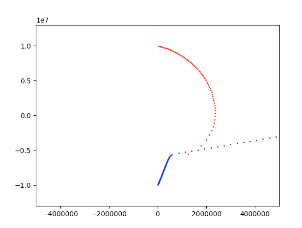

# Celestial Body Model
Modeling the Path of Celestial Bodies through 2D Space using Euler's integration method.

## Running
Simply run `$ python3 main.py` to run the model.  
Change `input.json` to fit values that you would like. Follow the model provided.

## Requirements
Python 3.6  
Matplotlib
If you do not want to install Matplotlib, you can disable graphing by changing the Matplotlib value to `false` in `inputs.json`.

## Sample Data
Using the sample data provided, the graph should look like this:

